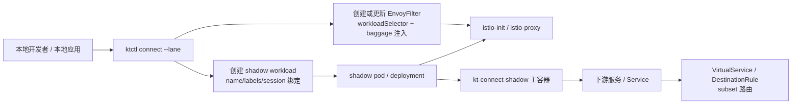
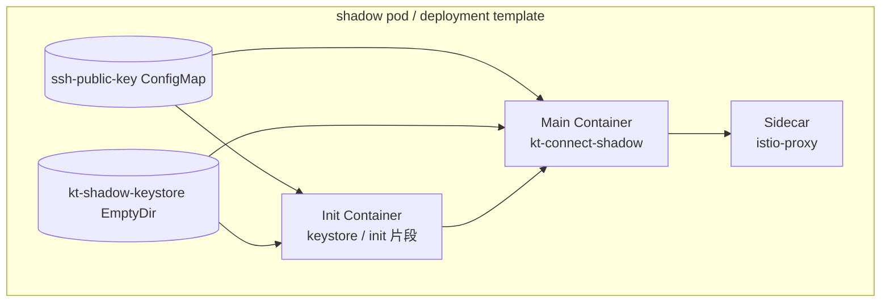
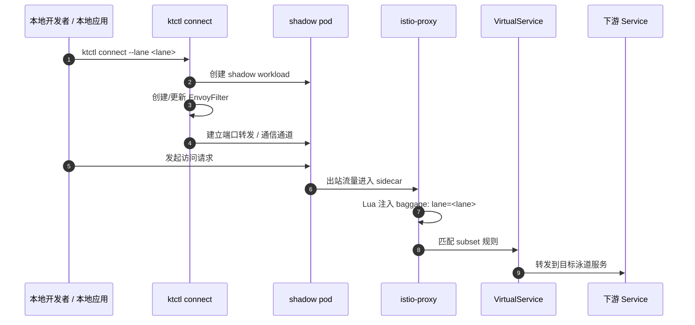
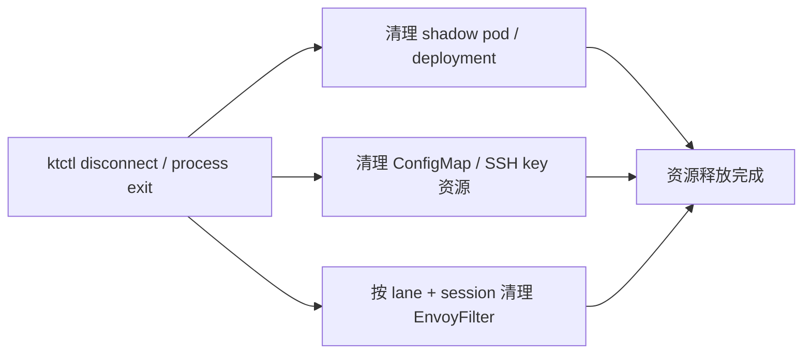

# 多泳道（lane-aware shadow）实现原理

> 说明：本文基于当前 `kt-connect` 的 lane-aware shadow 实现整理，重点解释 `ktctl connect --lane` 这条链路如何把本地调试流量带入目标泳道，并通过 `baggage: lane=<lane>` 让 Istio subset 路由命中对应版本。

## 1. 为什么要做这条链路

在普通 `ktctl connect` 场景里，本地流量虽然能进入集群，但它并不天然携带“泳道上下文”。对于依赖 Istio subset 的系统来说，路由规则通常会根据 `baggage` 或其他请求头来决定命中哪个 subset。

所以多泳道链路的核心目标不是“再造一个代理”这么简单，而是：

1. 让本地调试流量进入一个**带 sidecar 的 shadow workload**。
2. 让这个 workload 的出站请求自动携带 `baggage: lane=<lane>`。
3. 让 Istio 在出站路径上读取这个请求头，并按 VirtualService 的 subset 规则命中目标泳道。
4. 在退出会话时，把 shadow workload 和相关 Istio 资源一起清理掉。

## 2. 整体架构

### 角色分工

| 组件 | 作用 |
| --- | --- |
| `ktctl connect --lane <lane>` | 启动 lane 会话，创建 shadow 资源，记录 lane/session 状态 |
| shadow workload | 承载本地流量进入集群后的“出站代理”能力 |
| `kt-connect-shadow` | 主容器，负责接收/转发请求（并配合 sidecar 完成出站链路） |
| `istio-init` | 配置 iptables，把出站流量导向 sidecar |
| `istio-proxy` | 负责接管出站流量并执行 EnvoyFilter 规则 |
| EnvoyFilter | 在 sidecar 出站路径上注入/归一化 `baggage` |
| `CleanupWorkspace()` | disconnect 时回收 shadow 与 EnvoyFilter |

## 3. `ktctl connect --lane` 的控制面流程

### 3.1 参数与会话状态

`connect` 启动后，会把 lane 相关信息写入运行时状态：

- `opt.Get().Connect.Lane`：当前会话的 lane 名称
- `opt.Store.Session`：本次连接会话 ID
- `opt.Store.Shadow`：shadow 资源名
- `opt.Store.LaneEnvoyFilter`：为本次会话创建的 EnvoyFilter 名称

这些状态很关键，因为后续清理资源时不能只按名字删，还要按 `lane + session` 限定范围，避免误删别的会话。

### 3.2 创建 shadow workload

lane 模式下，shadow workload 会被赋予这些标识：

- `kt-role=shadow-connect`
- `kt-lane=<lane>`
- `kt-session=<session>`
- `sidecar.istio.io/inject=true`

同时会带上 sidecar 资源注解，例如：

- `sidecar.istio.io/proxyCPU`
- `sidecar.istio.io/proxyCPULimit`
- `sidecar.istio.io/proxyMemory`
- `sidecar.istio.io/proxyMemoryLimit`

这一步的意义是：让 shadow workload 本身就具备“像正式业务 Pod 一样”的 Istio 入口条件，而不是只靠本地进程模拟。

## 4. shadow workload 的 Pod 结构

lane 模式下，shadow Pod 不是单容器，而是显式的多容器结构。

### 4.1 Init container：keystore / 初始化片段

当前 lane shadow 需要带上一个显式的 init 片段，目的不是“做业务逻辑”，而是把启动所需的文件和挂载准备好。

这类初始化一般承担两件事：

1. 把 SSH/授权相关内容准备到固定路径。
2. 准备主容器启动后可直接使用的 keystore/工作目录。

> 备注：不同集群里 keystore 的具体实现会有差异，但本项目的设计目标是把它显式表达在 PodSpec 里，而不是依赖隐式注入或外部人工操作。

### 4.2 主容器：`kt-connect-shadow`

主容器负责接收会话对应的请求，并把它们转入集群侧出站路径。

它的关键点在于：

- 不是单纯的“应用容器”；
- 它和 sidecar 配合，确保出站请求会进入 Istio 处理链；
- 它是 lane metadata 的承载点，后续 EnvoyFilter 也会按这些标签匹配。

### 4.3 Sidecar：`istio-proxy`

`istio-proxy` 的存在意味着：

- 这个 Pod 的出站流量会经过 Istio 数据面；
- EnvoyFilter 能对它生效；
- 任何基于 `baggage` 的 subset 路由规则都能在这里被识别。

这也是为什么你最终能看到 `HTTP_FILTER` / Lua 或类似 patch 的根本原因：**过滤器是在 sidecar 上运行的，不是在业务容器里运行的。**

## 5. baggage 是怎么被自动带上的

这是这条链路里最关键的一步。

### 5.1 为什么不直接改业务代码

多泳道希望“对业务透明”。如果要每个业务自己写 header 逻辑，成本高、侵入性强，而且容易漏。

所以更合理的做法是：

- 在 shadow workload 出站侧统一注入 `baggage`；
- 由 Istio sidecar 执行这一动作；
- 业务代码无需感知 lane 逻辑。

### 5.2 现在的实现方式

当前实现里，lane 会话会创建一个 namespace 级别的 `EnvoyFilter`，它通过 `workloadSelector` 精确选中这次 connect 的 shadow Pod，然后在 sidecar 的出站链路中插入 Lua 逻辑。

这个 Lua 逻辑负责：

1. 读取原有 `baggage`；
2. 如果没有 `baggage`，直接设置为 `lane=<lane>`；
3. 如果有 `baggage`，保留其它成员，只替换/归一化 `lane=` 成员；
4. 最终把新的 `baggage` 写回请求头。

### 5.3 为什么用 HTTP_FILTER 而不是只写 HTTP_ROUTE

`HTTP_ROUTE` 更像“在某条 route 上追加配置”；但对 gRPC/HTTP2 这类流量，实际命中的 route、listener 以及 Envoy 版本相关性比较强。

而 `HTTP_FILTER + Lua` 的思路是：

- 更早进入 sidecar 的 HTTP 过滤链；
- 不依赖具体 route 名称是否可见；
- 对 HTTP/1.1、HTTP/2、gRPC 的覆盖更稳定。

因此在当前实现中，**真正做 baggage 注入的是 EnvoyFilter，而不是 shadow 容器本身。**

## 6. 请求链路是怎么走的

### 这条链路的关键判断点

1. `shadow pod` 必须有 `istio-proxy`。
2. `EnvoyFilter` 必须匹配到这个 shadow Pod 的 `workloadSelector`。
3. 下游服务的 VirtualService 必须按 `baggage: lane=<lane>` 做匹配。
4. 下游 Service 的协议识别最好是 HTTP / gRPC，而不是纯 TCP。

如果任一环节断了，最终就会出现“Pod 起了，但请求还是没进对应泳道”。

## 7. 为什么你的 gRPC 场景会受影响

你现在已经验证了：

- shadow Pod 有 `istio-proxy`
- `EnvoyFilter` 存在
- 目标 Service 端口 `appProtocol: grpc`

这说明大框架基本没问题。

但是要注意两件事：

1. **gRPC 仍然会走 HTTP2 过滤链，但前提是 sidecar 正确识别为 HTTP/gRPC 流量。**
2. 如果最终命中的是一个纯 TCP 场景，`HTTP_FILTER` 就不会生效。

所以这条链路对 gRPC 是可行的，但它依赖 Istio 对该流量做出 HTTP/gRPC 识别，而不是裸 TCP 转发。

## 8. disconnect / 清理流程

清理时，系统会按会话状态进行 best-effort 删除：

- 根据 `kt-lane` + `kt-session` 选择本次会话资源；
- 清理 shadow pod/deployment；
- 清理对应 ConfigMap；
- 删除本次会话创建的 `EnvoyFilter`；
- 如果多个残留资源存在，也会按 label selector 继续回收。

这一步很重要，因为如果 EnvoyFilter 不删，后面新的 lane 会话可能会受到旧规则影响，排查起来会非常像“幽灵 bug”。

## 9. 与正式多泳道应用 Pod 的对齐点

你给的正式应用 Pod（`describe-current-mesh-pod`）有几个值得对齐的结构：

- `sidecar.istio.io/inject=true`
- `sidecar.istio.io/proxyCPU` / `proxyMemory` 注解
- `istio-init`
- `istio-proxy`
- keystore init 容器
- keystore / tls 相关 volume

lane-aware shadow 的目标不是复制所有业务容器，而是把这些**关键的注入能力**补齐，做到：

- 网络链路能被 Istio 接管；
- 出站请求能自动携带 lane；
- 请求能按泳道路由；
- 会话结束后资源能被回收。

## 10. 一句话总结

这条链路本质上是：

> **用一个带 Istio sidecar 的 session-scoped shadow workload，承接本地调试流量；再通过 EnvoyFilter 在出站侧统一注入 `baggage: lane=<lane>`，让下游 Istio subset 路由能正确命中目标泳道。**

## 11. 参考代码位置

- `pkg/kt/command/connect/common.go`
- `pkg/kt/service/cluster/shadow_pod.go`
- `pkg/kt/service/cluster/helper.go`
- `pkg/kt/service/cluster/lane.go`
- `pkg/kt/command/general/teardown.go`
- `pkg/shadow/proxy/proxy.go`
- `cmd/shadow/main.go`

## 12. 验证建议

如果你要验证这条链路是否完整，建议按下面顺序看：

1. `kubectl get pod ... --show-labels`：确认 lane/session/sidecar label。
2. `kubectl describe pod ...`：确认 `istio-proxy`、keystore init、volume mounts。
3. `kubectl get envoyfilter ... -o yaml`：确认 selector 和 baggage 注入规则。
4. `istioctl proxy-config listeners|routes ...`：确认 sidecar 侧配置真正生效。
5. 访问下游服务并观察服务端日志：确认请求头里出现 `baggage: lane=<lane>`。
6. `disconnect` 后再查：确认 shadow / EnvoyFilter 都被清理。

